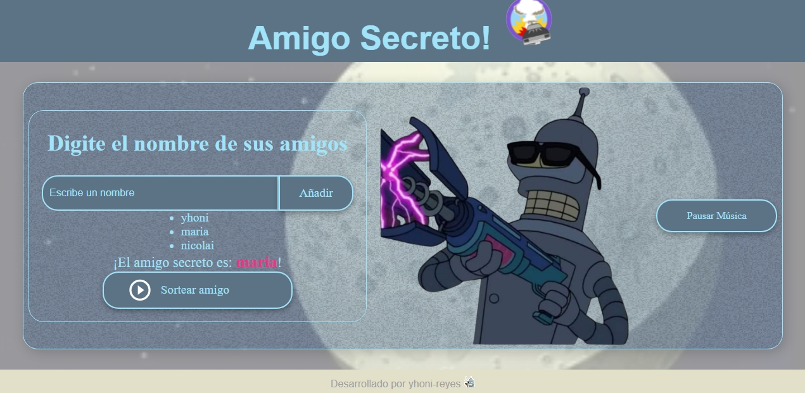

# 🎁 Amigo Secreto

Este proyecto es una aplicación que permite ingresar nombres de amigos en una lista para luego realizar un sorteo aleatorio y determinar quién será el amigo secreto de cada participante.

## 🚀 Tecnologías utilizadas
- JavaScript (Node.js en el backend)
- HTML y CSS (si tiene interfaz web)

## 📌 Funcionalidades
✅ Agregar nombres a la lista de participantes  
✅ Realizar un sorteo aleatorio  
✅ Mostrar el resultado del sorteo  
✅ (Opcional) Guardar los datos en un archivo o base de datos  

## 🎲 Cómo usarlo
1. Ingresa en este enlace
http:juego secreto.com
2. Ingresa el nombre de por lo menos 2 amigos
3. Da click en sortear amigos
4. Listo! quien es tu amigo secreto..?

##🖼️ Vista Previa

## Hecho por:

### yhoni-reyes 

### Linkedin: https://www.linkedin.com/in/jonathan-israel-reyes-m%C3%A9ndez-257b58318/
 
